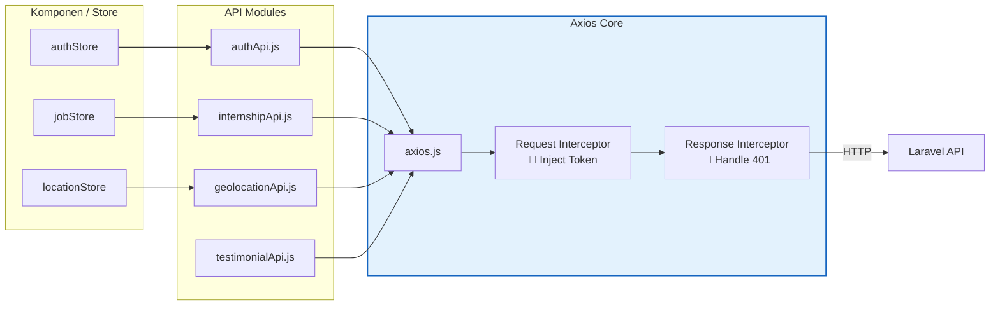
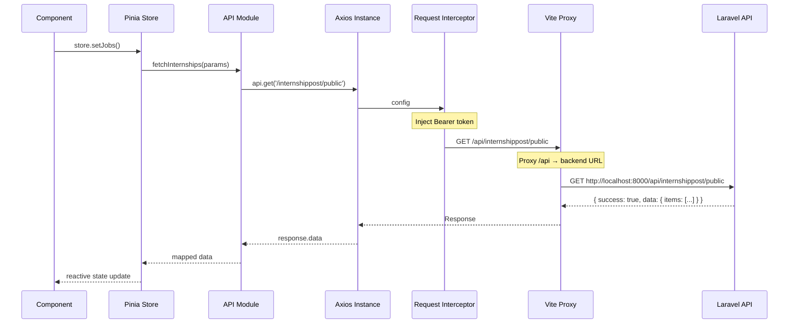

# API Layer (Axios)

## Arsitektur API

Semua HTTP communication dikelola melalui **centralized Axios instance** dengan interceptors:



## Axios Instance (`axios.js`)

### Konfigurasi Dasar

```js
const api = axios.create({
  baseURL: '/api',           // Proxy via Vite
  withCredentials: true,     // Kirim cookie (CSRF, session)
  headers: {
    'Content-Type': 'application/json',
    Accept: 'application/json',
  },
})
```

### Request Interceptor

Menyisipkan JWT token dari `localStorage` ke setiap request:

```js
api.interceptors.request.use((config) => {
  const token = localStorage.getItem('token')
  if (token) {
    config.headers.Authorization = `Bearer ${token}`
  }
  return config
})
```

### Response Interceptor

Menangani error 401 (token expired) secara global:

```js
api.interceptors.response.use(
  (response) => response,
  (error) => {
    if (error.response?.status === 401) {
      // Dynamic import untuk hindari circular dependency
      import('@/stores/authStore').then(({ useAuthStore }) => {
        const authStore = useAuthStore()
        authStore.forceLogout()
        window.location.href = '/login'
      })
    }
    return Promise.reject(error)
  }
)
```

::: warning Circular Dependency
`authStore` di-import secara **dinamis** (`import()`) di interceptor untuk menghindari circular dependency, karena `authStore` juga mengimpor `axios.js`.
:::

---

## API Modules

### authApi.js

| Method | Endpoint | Deskripsi |
|--------|----------|-----------|
| `login(credentials)` | `POST /api/login` | Login dengan email & password |
| `register(userData)` | `POST /api/register` | Registrasi user baru |
| `logout()` | `POST /api/logout` | Logout & invalidate token |
| `getProfile()` | `GET /api/user` | Ambil profil user yang sedang login |

### internshipApi.js

| Method | Endpoint | Deskripsi |
|--------|----------|-----------|
| `fetchInternships(params)` | `GET /api/internshippost/public` | Daftar lowongan dengan filter |
| `fetchInternshipById(id)` | `GET /api/internshippost/:id` | Detail satu lowongan |

**Parameter `fetchInternships`:**

| Param | Tipe | Deskripsi |
|-------|------|-----------|
| `search` | `String` | Pencarian judul/perusahaan |
| `available` | `String` | Status: `open` / `closed` |
| `work_type` | `String` | Tipe: `remote` / `onsite` / `hybrid` |
| `program_type_id` | `String` | UUID tipe program |
| `duration` | `Number` | Durasi dalam bulan |
| `sort_by` | `String` | Kolom sort: `created_at`, `deadline`, `title`, `duration` |
| `sort_order` | `String` | Arah: `asc` / `desc` |

::: tip Parameter Cleaning
Parameter kosong (`null`, `undefined`, `''`, `'all'`) otomatis dihapus sebelum dikirim ke API:

```js
const cleanParams = {}
for (const [key, value] of Object.entries(params)) {
  if (value !== null && value !== undefined && value !== '' && value !== 'all') {
    cleanParams[key] = value
  }
}
```
:::

### geolocationApi.js

| Method | Endpoint | Deskripsi |
|--------|----------|-----------|
| `fetchProvinces(q?)` | `GET /api/provinces` | Daftar provinsi (opsional search) |
| `fetchCities(province, q?)` | `GET /api/cities?province=X` | Daftar kota berdasarkan provinsi |

**Format Respons:**
```json
{
  "data": {
    "existing": ["Semarang", "Solo"],
    "geo": ["Semarang", "Surakarta", "Magelang"]
  }
}
```

### testimonialApi.js

| Method | Endpoint | Deskripsi |
|--------|----------|-----------|
| `fetchTestimonials()` | `GET /api/testimonials` | Daftar testimoni aktif |

**Format Respons:**
```json
{
  "success": true,
  "data": [
    {
      "id": "uuid",
      "testimonial": "Pengalaman magang...",
      "user_role": "Mahasiswa",
      "user": {
        "id": "uuid",
        "name": "John Doe",
        "avatar_path": "/storage/avatars/..."
      }
    }
  ]
}
```

---

## Flow Request Lengkap


