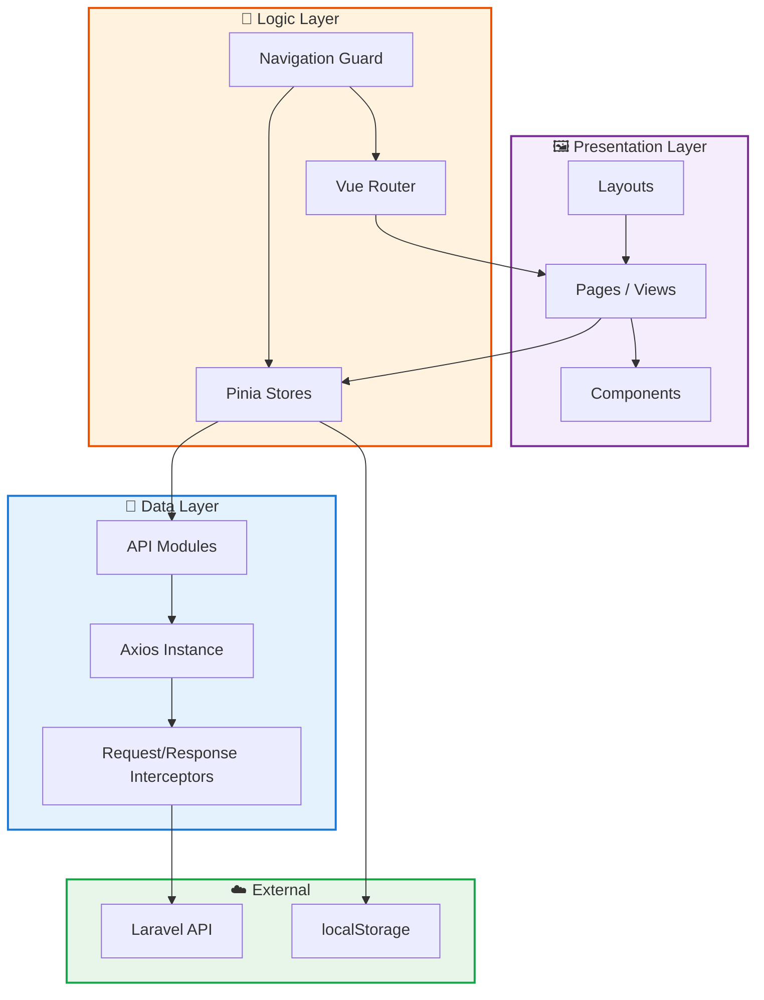
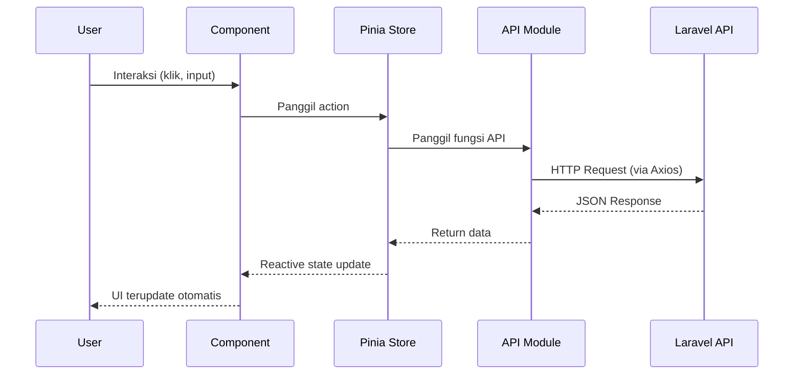

# Arsitektur Aplikasi

## Overview

IIF Frontend dibangun dengan arsitektur **layered** yang memisahkan tanggung jawab ke dalam beberapa lapisan:



## Entry Point

### `main.js`

```js
import { createApp } from 'vue'
import { createPinia } from 'pinia'
import router from './router'
import './style.css'
import App from './App.vue'

const app = createApp(App)
const pinia = createPinia()

app.use(pinia)    // State management
app.use(router)   // Routing
app.mount('#app') // Mount ke DOM
```

**Urutan inisialisasi:**
1. Import dan create Vue app instance
2. Create Pinia store instance
3. Register Pinia dan Router sebagai plugin
4. Mount aplikasi ke elemen `#app` di `index.html`

### `App.vue`

Root component hanya berisi `<RouterView />` — seluruh rendering dikendalikan oleh Vue Router:

```vue
<script setup>
import { RouterView } from 'vue-router'
</script>

<template>
  <RouterView />
</template>
```

## Alur Data (Data Flow)



### Penjelasan Flow

1. **User** berinteraksi dengan komponen (klik tombol, isi form, dsb.)
2. **Component** memanggil action dari Pinia store
3. **Store** memanggil fungsi di API module
4. **API module** mengirim HTTP request via Axios instance (yang sudah dikonfigurasi dengan interceptors)
5. **Backend** memproses request dan mengembalikan JSON
6. **Store** menyimpan data ke state reactif
7. **Component** otomatis terupdate karena state binding reactif dari Pinia

## Pola Desain yang Digunakan

### 1. Composition API Pattern
Semua komponen menggunakan `<script setup>` — lebih ringkas dan performant.

### 2. Store Pattern (Pinia)
State dipusatkan di store, bukan di komponen. Ini memudahkan sharing data antar komponen.

### 3. Repository Pattern (API Layer)
Setiap domain memiliki file API sendiri (`authApi.js`, `internshipApi.js`, dll.) yang meng-abstract endpoint.

### 4. Proxy Pattern (Vite Proxy)
Request `/api/*` di-proxy ke backend untuk menghindari CORS issues di development.

### 5. Guard Pattern (Navigation Guard)
Route-level access control menggunakan `beforeEach` hook di Vue Router.
