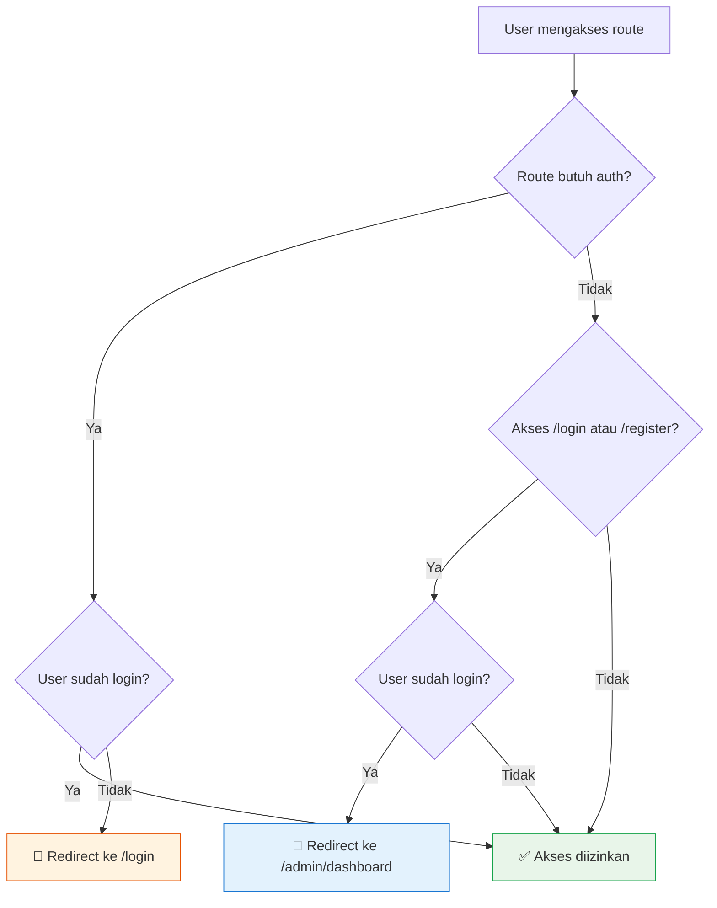

# Routing & Navigation Guard

## Daftar Routes

Aplikasi memiliki **12 route** yang terbagi menjadi 2 kelompok:

### Route Publik

| Path | Name | Component | Deskripsi |
|------|------|-----------|-----------|
| `/` | `Home` | `LandingPage` | Halaman utama dengan hero, daftar lowongan, cara kerja, dan testimoni |
| `/job/:id` | `JobDetail` | `JobDetailPage` | Detail lowongan magang (props: `id`) |
| `/results` | `Results` | `ResultsPage` | Hasil pencarian lowongan |
| `/login` | `Login` | `LoginPage` | Halaman login |
| `/register` | `Register` | `RegisterPage` | Halaman registrasi |

### Route Admin (Protected)

| Path | Name | Component | Auth |
|------|------|-----------|------|
| `/admin/dashboard` | `AdminDashboard` | `DashboardPage` | ✅ |
| `/admin/postingan` | `ManajemenPostingan` | `ManajemenPostingan` | ✅ |
| `/admin/mitra` | `ManajemenMitra` | `ManajemenMitra` | ✅ |
| `/admin/user` | `ManajemenUser` | `ManajemenUser` | ✅ |
| `/admin/testimoni` | `Testimoni` | `TestimoniPage` | ✅ |
| `/admin/aproval` | `Aproval` | `AprovalPage` | ✅ |
| `/admin/aktivitas` | `AktivitasSistem` | `AktivitasSistem` | ✅ |

## Konfigurasi Router

```js
import { createRouter, createWebHistory } from 'vue-router'

const router = createRouter({
  history: createWebHistory(),  // HTML5 History Mode (URL bersih tanpa #)
  routes
})
```

::: info History Mode
Menggunakan `createWebHistory()` artinya URL tidak menggunakan hash (`#`). Namun ini memerlukan konfigurasi server agar semua route di-redirect ke `index.html`.
:::

## Route Meta

Route admin dilindungi dengan meta `requiresAuth`:

```js
{
  path: '/admin/dashboard',
  name: 'AdminDashboard',
  component: DashboardPage,
  meta: { requiresAuth: true }  // 🔒 Harus login
}
```

## Navigation Guard

### Flow Diagram



### Implementasi

```js
router.beforeEach((to, from) => {
  const authStore = useAuthStore()

  // 🔒 Proteksi route admin
  if (to.meta.requiresAuth && !authStore.isAuthenticated) {
    return '/login'
  }

  // 🔀 Redirect user yang sudah login dari halaman auth
  if ((to.path === '/login' || to.path === '/register')
      && authStore.isAuthenticated) {
    return '/admin/dashboard'
  }

  // ✅ Lanjutkan navigasi normal
})
```

### Logika Guard

| Skenario | Kondisi | Aksi |
|----------|---------|------|
| Akses admin tanpa login | `requiresAuth && !authenticated` | Redirect → `/login` |
| Akses login saat sudah login | `path=/login && authenticated` | Redirect → `/admin/dashboard` |
| Akses register saat sudah login | `path=/register && authenticated` | Redirect → `/admin/dashboard` |
| Lainnya | — | Lanjutkan normal |

## Dynamic Route Params

Route `/job/:id` menggunakan **props: true** sehingga `id` otomatis dikirim sebagai prop ke komponen:

```js
{
  path: '/job/:id',
  name: 'JobDetail',
  component: JobDetailPage,
  props: true  // id dikirim sebagai prop
}
```

Di komponen:

```vue
<script setup>
const props = defineProps({
  id: String
})
// Gunakan props.id untuk fetch detail
</script>
```
