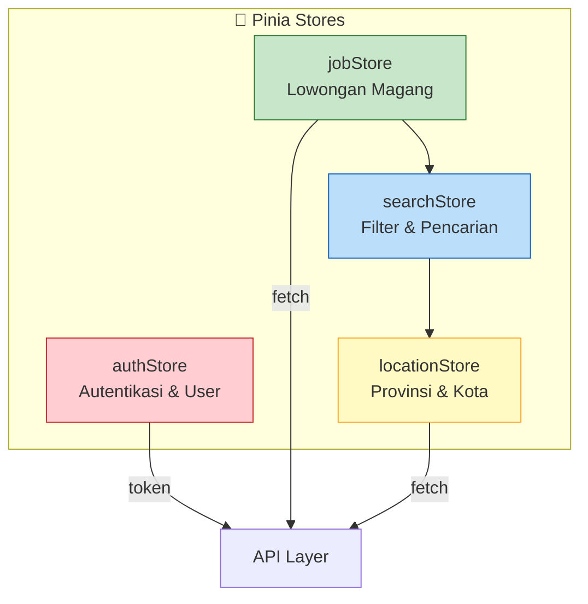
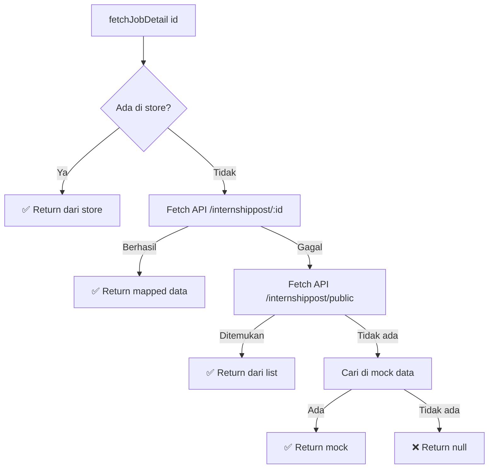
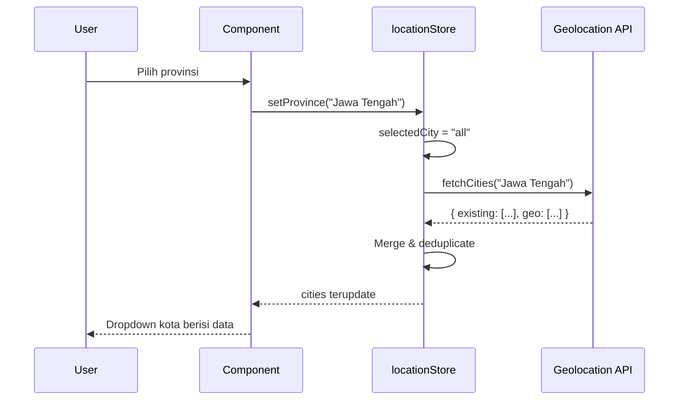

# State Management (Pinia)

## Overview

Aplikasi menggunakan **4 Pinia stores** untuk mengelola state:



---

## authStore

**File:** `src/stores/authStore.js`

Mengelola autentikasi, token JWT, dan profil user.

### State

| Property | Tipe | Default | Deskripsi |
|----------|------|---------|-----------|
| `user` | `Object\|null` | dari localStorage | Data user yang login |
| `token` | `String\|null` | dari localStorage | JWT token |
| `isLoading` | `Boolean` | `false` | Status loading |
| `error` | `String\|null` | `null` | Pesan error |

### Getters

| Getter | Return | Deskripsi |
|--------|--------|-----------|
| `isAuthenticated` | `Boolean` | `true` jika token ada |
| `isAdmin` | `Boolean` | `true` jika role admin/superadmin |

### Actions

| Action | Parameter | Deskripsi |
|--------|-----------|-----------|
| `login(email, password)` | Credentials | Login via API, simpan token ke localStorage |
| `fetchProfile()` | — | Ambil profil user dari API |
| `logout()` | — | Hapus token, panggil API logout |
| `forceLogout()` | — | Logout paksa (dipanggil dari 401 interceptor) |

### Persistence

Token dan user data disimpan di `localStorage` agar state bertahan setelah refresh:

```js
// Saat login berhasil
localStorage.setItem('token', data.token)
localStorage.setItem('user', JSON.stringify(data.user))

// Saat inisialisasi store
state: () => ({
  user: JSON.parse(localStorage.getItem('user')) || null,
  token: localStorage.getItem('token') || null,
})
```

---

## jobStore

**File:** `src/stores/jobStore.js`

Store terbesar — mengelola data lowongan magang, mapping data API, dan filter.

### State

| Property | Tipe | Deskripsi |
|----------|------|-----------|
| `jobs` | `Array` | Semua lowongan (sudah di-map) |
| `filteredJobs` | `Array` | Lowongan setelah filter |
| `loading` | `Boolean` | Status loading |
| `error` | `String\|null` | Pesan error |
| `usingMockData` | `Boolean` | `true` jika menggunakan data mock |

### Data Mapping: `mapApiToCard()`

Fungsi internal yang memetakan respons API ke format komponen:

```
API Response (raw)              →    Frontend Format (mapped)
─────────────────────────────        ────────────────────────────
{                                    {
  id,                                  id,
  title,                               title,
  available: "open",                   status: "Open",
  program_type: { name },              category: "Internship",
  duration: 3,                         duration: "3 Months",
  company: { name, logo_path },        company: "Nama PT",
  requirements: [...],                 requirements: [...],
  ...                                  _raw: { original data }
}                                    }
```

### Actions

| Action | Deskripsi |
|--------|-----------|
| `setJobs(params)` | Fetch semua lowongan, dengan fallback ke mock data |
| `fetchJobDetail(id)` | Ambil detail lowongan (store → API detail → API list → mock) |
| `searchJobs(query, filters)` | Pencarian via API |
| `filterByCategory(category)` | Filter lokal berdasarkan kategori |
| `filterByStatus(status)` | Filter lokal berdasarkan status |
| `filterByLocation(location)` | Filter lokal berdasarkan lokasi |
| `applyFilters(filters)` | Terapkan multiple filter sekaligus |
| `resetFilters()` | Reset semua filter |

### Strategi Fetch Detail



---

## searchStore

**File:** `src/stores/searchStore.js`

Mengelola state form pencarian dan filter.

### State

| Property | Tipe | Default | Deskripsi |
|----------|------|---------|-----------|
| `searchQuery` | `String` | `''` | Teks pencarian |
| `selectedStatus` | `String` | `'all'` | Filter status (all/open/closed) |
| `selectedLocation` | `String` | `'all'` | Filter lokasi |
| `selectedType` | `String` | `'all'` | Filter tipe |
| `searchHistory` | `Array` | `[]` | Riwayat pencarian (maks 10) |

### Actions

| Action | Deskripsi |
|--------|-----------|
| `setSearchQuery(query)` | Set teks pencarian |
| `setSelectedStatus(status)` | Set filter status |
| `setSelectedLocation(location)` | Set filter lokasi |
| `setSelectedType(type)` | Set filter tipe |
| `addToSearchHistory(query)` | Tambah ke riwayat (maks 10, tanpa duplikat) |
| `getApiParams()` | Build parameter API dari state saat ini |
| `clearSearch()` | Reset semua filter + lokasi |

### `getApiParams()` — Membangun Query

```js
const getApiParams = () => {
  const params = {}
  if (searchQuery.value.trim()) params.search = searchQuery.value.trim()
  if (selectedStatus.value !== 'all') params.available = selectedStatus.value

  // Ambil lokasi dari locationStore
  const locationStore = useLocationStore()
  const locationParam = locationStore.getLocationParam()
  if (locationParam) params.location = locationParam

  return params
}
```

---

## locationStore

**File:** `src/stores/locationStore.js`

Mengelola data geolocation untuk cascading dropdown provinsi → kota.

### State

| Property | Tipe | Default | Deskripsi |
|----------|------|---------|-----------|
| `provinces` | `Array` | `[]` | Daftar provinsi |
| `cities` | `Array` | `[]` | Daftar kota |
| `selectedProvince` | `String` | `'all'` | Provinsi terpilih |
| `selectedCity` | `String` | `'all'` | Kota terpilih |
| `loadingProvinces` | `Boolean` | `false` | Loading state provinsi |
| `loadingCities` | `Boolean` | `false` | Loading state kota |

### Cascading Dropdown Flow



### Data Merging

API mengembalikan 2 sumber data yang digabungkan tanpa duplikat:
- **`existing`** — Kota/provinsi dari data perusahaan di database
- **`geo`** — Kota/provinsi dari database geolocation

```js
const merged = [...new Set([...existing, ...geo])].sort()
```

### `getLocationParam()` — Prioritas Lokasi

```
Kota dipilih?  → return kota
Provinsi dipilih? → return provinsi (tanpa prefix DKI/DI)
Tidak ada?     → return null
```
