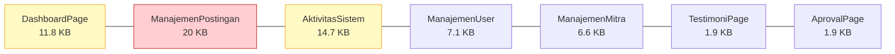

# Halaman Admin

## Overview

Panel admin terdiri dari **7 halaman** yang semuanya dilindungi oleh navigation guard (`meta: { requiresAuth: true }`). Semua halaman admin menggunakan `AdminLayout` sebagai wrapper.

## Daftar Halaman

| Halaman | File | Route | Deskripsi |
|---------|------|-------|-----------|
| Dashboard | `DashboardPage.vue` | `/admin/dashboard` | Ringkasan statistik dan chart |
| Manajemen Postingan | `ManajemenPostingan.vue` | `/admin/postingan` | CRUD lowongan magang |
| Manajemen Mitra | `ManajemenMitra.vue` | `/admin/mitra` | Kelola perusahaan mitra |
| Manajemen User | `ManajemenUser.vue` | `/admin/user` | Kelola akun pengguna |
| Testimoni | `TestimoniPage.vue` | `/admin/testimoni` | Kelola testimoni |
| Approval | `AprovalPage.vue` | `/admin/aproval` | Approval postingan/registrasi |
| Aktivitas Sistem | `AktivitasSistem.vue` | `/admin/aktivitas` | Log aktivitas sistem |

## Kompleksitas per Halaman

---

## Detail Halaman

### DashboardPage (11.8 KB)

**Route:** `/admin/dashboard`

Halaman utama admin setelah login. Menampilkan ringkasan statistik.

**Fitur:**
- Stat cards (total lowongan, total perusahaan, total user, dll.)
- Chart / grafik
- Ringkasan data terbaru

---

### ManajemenPostingan (20 KB)

**Route:** `/admin/postingan`

Halaman terbesar — mengelola lowongan magang (CRUD).

**Fitur:**
- Tabel daftar postingan
- Form tambah/edit postingan (modal)
- Filter dan pencarian
- Status toggle (Open/Closed)
- Pagination
- Aksi hapus dengan konfirmasi

---

### ManajemenMitra (6.6 KB)

**Route:** `/admin/mitra`

Kelola perusahaan mitra yang menyediakan lowongan.

**Fitur:**
- Daftar perusahaan mitra
- Tambah/edit perusahaan
- Upload logo perusahaan
- Informasi kontak dan lokasi

---

### ManajemenUser (7.1 KB)

**Route:** `/admin/user`

Kelola akun pengguna sistem.

**Fitur:**
- Daftar user
- Role management
- Status akun (aktif/nonaktif)
- Reset password

---

### TestimoniPage (1.9 KB)

**Route:** `/admin/testimoni`

Kelola testimoni yang tampil di landing page.

**Fitur:**
- Daftar testimoni
- Approve/reject testimoni
- Status aktif/nonaktif

---

### AprovalPage (1.9 KB)

**Route:** `/admin/aproval`

Halaman approval untuk postingan atau registrasi.

**Fitur:**
- Daftar item menunggu approval
- Aksi approve/reject

---

### AktivitasSistem (14.7 KB)

**Route:** `/admin/aktivitas`

Log aktivitas seluruh sistem.

**Fitur:**
- Timeline aktivitas
- Filter berdasarkan tipe aktivitas
- Detail log per aktivitas
- Pagination
