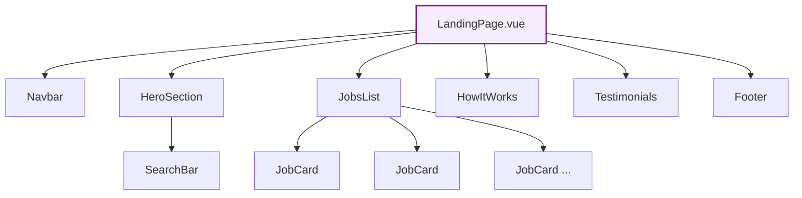

# Komponen Publik

## Daftar Komponen

Komponen publik digunakan di halaman-halaman yang bisa diakses tanpa login:

| Komponen | File | Digunakan Di |
|----------|------|-------------|
| `Navbar` | `Navbar.vue` | Semua halaman publik |
| `HeroSection` | `HeroSection.vue` | LandingPage |
| `SearchBar` | `SearchBar.vue` | LandingPage, ResultsPage |
| `JobsList` | `JobsList.vue` | LandingPage |
| `JobCard` | `JobCard.vue` | JobsList, ResultsPage |
| `HowItWorks` | `HowItWorks.vue` | LandingPage |
| `Testimonials` | `Testimonials.vue` | LandingPage |
| `Footer` | `Footer.vue` | Semua halaman publik |

## Komposisi Halaman

### LandingPage



```vue
<!-- LandingPage.vue -->
<template>
  <div class="min-h-screen bg-white">
    <Navbar />
    <main>
      <HeroSection />
      <JobsList />
      <HowItWorks />
      <Testimonials />
    </main>
    <Footer />
  </div>
</template>
```

---

## Detail Komponen

### Navbar

**File:** `src/components/Navbar.vue` (4 KB)

Navigasi header di semua halaman publik.

**Fitur:**
- Logo dan link navigasi
- Responsif (hamburger menu di mobile)
- Link ke Login/Register

---

### HeroSection

**File:** `src/components/HeroSection.vue` (11 KB)

Banner utama landing page.

**Fitur:**
- Headline dan tagline
- Integrasi SearchBar
- Background animasi/gradient
- Call-to-action buttons

---

### SearchBar

**File:** `src/components/SearchBar.vue` (6.5 KB)

Form pencarian lowongan magang.

**Store yang digunakan:**
- `searchStore` — untuk state query dan filter
- `locationStore` — untuk dropdown provinsi & kota
- `jobStore` — untuk trigger pencarian

**Fitur:**
- Input teks pencarian
- Dropdown filter status (Open/Closed)
- Cascading dropdown lokasi (Provinsi → Kota)
- Search history
- Navigasi ke ResultsPage dengan query params

---

### JobsList

**File:** `src/components/JobsList.vue` (7.8 KB)

Daftar lowongan magang di landing page.

**Store yang digunakan:**
- `jobStore` — fetch dan tampilkan lowongan

**Fitur:**
- Grid/list view kartu lowongan
- Loading skeleton
- Empty state handling
- Pagination atau load more

---

### JobCard

**File:** `src/components/JobCard.vue` (4.5 KB)

Kartu individual lowongan magang.

**Props yang diterima:**

| Prop | Tipe | Deskripsi |
|------|------|-----------|
| `id` | `String` | UUID lowongan |
| `title` | `String` | Judul posisi |
| `company` | `String` | Nama perusahaan |
| `category` | `String` | Internship / Studi Independen |
| `duration` | `String` | Durasi (e.g., "3 Months") |
| `location` | `String` | Lokasi magang |
| `work_type` | `String` | Remote / Onsite / Hybrid |
| `status` | `String` | Open / Closed |

**Fitur:**
- Badge kategori (warna berbeda per tipe)
- Status badge (Open = hijau, Closed = merah)
- Hover effect dan animasi
- Link ke halaman detail (`/job/:id`)

---

### HowItWorks

**File:** `src/components/HowItWorks.vue` (2.6 KB)

Seksi penjelasan langkah-langkah cara kerja platform.

**Fitur:**
- Step cards dengan icon
- Scroll animation (`animate-on-scroll`)
- Responsive grid layout

---

### Testimonials

**File:** `src/components/Testimonials.vue` (13 KB)

Seksi testimoni dari pengguna.

**Store yang digunakan:**
- Fetch data dari `testimonialApi`

**Fitur:**
- Multi-column scrolling testimonials
- Auto-scroll animation (marquee vertikal)
- Avatar dan nama user
- CSS mask gradient effect (fade top/bottom)

---

### Footer

**File:** `src/components/Footer.vue` (4.8 KB)

Footer website.

**Fitur:**
- Logo dan deskripsi
- Link navigasi
- Sosial media links
- Copyright text
