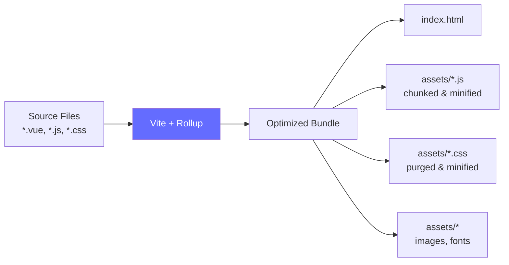

# Build & Preview

## NPM Scripts

| Perintah | Fungsi |
|----------|--------|
| `npm run dev` | Development server (Vite, port 5173) |
| `npm run build` | Production build ke `dist/` |
| `npm run preview` | Preview hasil build |

## Development

```bash
npm run dev
```

- Berjalan di `http://localhost:5173`
- Hot Module Replacement (HMR) aktif
- Proxy `/api` → backend URL
- Source maps tersedia untuk debugging

## Production Build

```bash
npm run build
```

### Apa yang Terjadi



Output build disimpan di folder `dist/`:

```
dist/
├── index.html
└── assets/
    ├── index-[hash].js      # Main bundle
    ├── index-[hash].css      # Purged CSS
    └── ...                   # Chunks & assets
```

### Optimisasi Otomatis

| Optimisasi | Deskripsi |
|------------|-----------|
| **Tree Shaking** | Menghapus kode yang tidak digunakan |
| **Code Splitting** | Memecah bundle menjadi chunks |
| **CSS Purging** | Tailwind menghapus class yang tidak dipakai |
| **Minification** | Kompresi JS dan CSS |
| **Asset Hashing** | Cache busting dengan hash di nama file |

## Preview

```bash
npm run preview
```

Menjalankan static server untuk preview hasil build di lokal. Berguna untuk memastikan build berjalan dengan benar sebelum deploy.

## Vite Configuration

**File:** `vite.config.js`

```js
export default defineConfig(({ mode }) => {
  const env = loadEnv(mode, process.cwd())

  return {
    plugins: [vue()],

    resolve: {
      alias: {
        '@': fileURLToPath(new URL('./src', import.meta.url))
      }
    },

    server: {
      host: '0.0.0.0',          // Akses dari luar (Docker)
      port: 5173,
      watch: {
        usePolling: true,        // Fix HMR di Docker
      },
      proxy: {
        '/api': {
          target: env.VITE_API_BASE_URL,
          changeOrigin: true,
          secure: false,
        }
      }
    }
  }
})
```

### Path Alias

```js
alias: {
  '@': './src'
}
```

Ini memungkinkan import menggunakan `@` sebagai shortcut ke folder `src/`:

```js
// ✅ Dengan alias
import Navbar from '@/components/Navbar.vue'

// ❌ Tanpa alias (relative path panjang)
import Navbar from '../../../components/Navbar.vue'
```

## Deployment Checklist

Sebelum deploy ke production, pastikan:

- [ ] `npm run build` berhasil tanpa error
- [ ] `npm run preview` menampilkan halaman dengan benar
- [ ] Environment variables production sudah dikonfigurasi
- [ ] Web server (Nginx) dikonfigurasi untuk SPA fallback (`try_files`)
- [ ] API proxy dikonfigurasi di web server
- [ ] HTTPS aktif

### Contoh Nginx Config

```nginx
server {
    listen 80;
    server_name yourdomain.com;
    root /var/www/iif-frontend/dist;
    index index.html;

    # SPA fallback
    location / {
        try_files $uri $uri/ /index.html;
    }

    # Proxy API ke backend
    location /api {
        proxy_pass http://localhost:8000;
        proxy_set_header Host $host;
        proxy_set_header X-Real-IP $remote_addr;
    }
}
```
