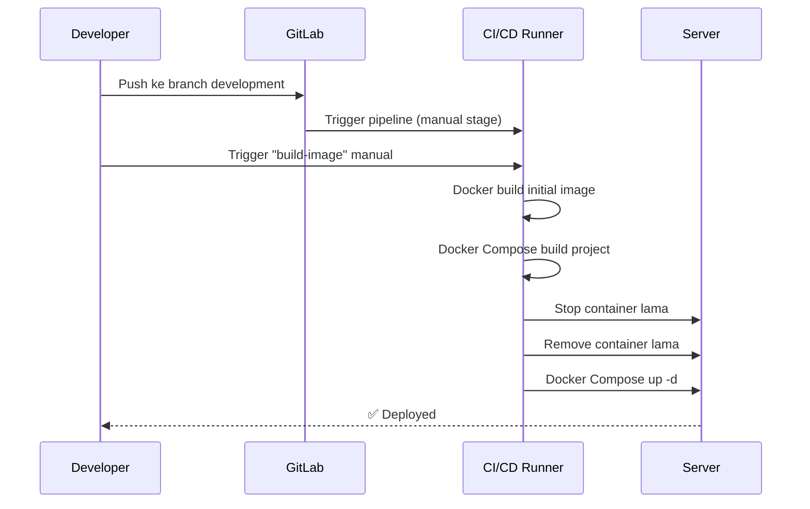

# CI/CD Pipeline

## Overview

Aplikasi menggunakan **GitLab CI/CD** dengan Docker-based deployment. Pipeline terdiri dari 3 stage:


## Pipeline Configuration

**File:** `.gitlab-ci.yml`

### Stages

```yaml
stages:
  - build
  - prepare
  - deploy
```

### Stage 1: Build Image (Manual)

```yaml
build-image:
  stage: build
  script:
    - docker build -f deployment/cicd/Dockerfile-initial -t iftern-frontend-initial-image .
  when: manual
  rules:
    - if: '$CI_COMMIT_BRANCH == "development"'
```

| Config | Nilai | Penjelasan |
|--------|-------|------------|
| `when` | `manual` | Harus di-trigger manual |
| `rules` | Branch `development` | Hanya jalan di branch development |
| Output | Docker image | `iftern-frontend-initial-image` |

### Stage 2: Build Project

```yaml
build-project-development:
  stage: build
  script:
    - docker-compose -f deployment/cicd/docker-compose-dev.yml build
  needs:
    - build-image
  rules:
    - if: '$CI_COMMIT_BRANCH == "development"'
```

Dependensi: harus menunggu `build-image` selesai.

### Stage 3: Clean (Prepare)

```yaml
clean-development:
  stage: prepare
  script:
    - docker stop iftern-frontend || true
    - docker rm -f iftern-frontend || true
  needs:
    - build-project-development
```

Menghentikan dan menghapus container lama sebelum deploy yang baru.

### Stage 4: Deploy

```yaml
deploy-development:
  stage: deploy
  script:
    - docker-compose -f deployment/cicd/docker-compose-dev.yml up -d
  needs:
    - clean-development
```

Menjalankan container baru di background (`-d`).

## Flow Deployment



## Catatan

::: warning Development Only
Pipeline ini hanya berjalan di branch `development`. Untuk production, perlu pipeline terpisah dengan:
- Multi-stage Docker build (build → serve via Nginx)
- Environment variables management
- Health check
- Rollback strategy
:::

::: info SonarQube
Project juga memiliki `sonar-project.properties` untuk integrasi static code analysis, namun belum terintegrasi ke pipeline CI/CD.
:::
