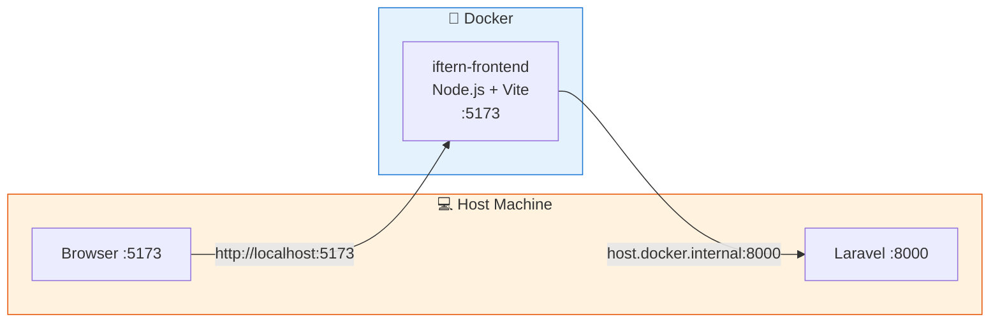

# Docker Setup

## Dockerfile

Aplikasi menggunakan **Node.js Alpine** image dengan Vite dev server:

```dockerfile
FROM node:lts-alpine

WORKDIR /app

# Install dependencies
COPY package*.json ./
RUN npm install

# Copy source code
COPY . .

EXPOSE 5173

CMD ["npm", "run", "dev"]
```

::: info
Dockerfile ini digunakan untuk **development**. Untuk production, sebaiknya buat multi-stage build yang menghasilkan static files dan disajikan via Nginx.
:::

## Docker Compose

```yaml
services:
  frontend:
    build:
      context: .
    container_name: iftern-frontend
    ports:
      - "5173:5173"
    environment:
      - VITE_API_BASE_URL=http://host.docker.internal:8000
    extra_hosts:
      - "host.docker.internal:host-gateway"
    volumes:
      - .:/app
      - /app/node_modules    # Hindari overwrite node_modules dari host
    networks:
      - iftern-network

networks:
  iftern-network:
    driver: bridge
```

### Penjelasan Konfigurasi

| Konfigurasi | Penjelasan |
|-------------|------------|
| `container_name` | Nama container: `iftern-frontend` |
| `ports: 5173:5173` | Map port Vite ke host |
| `host.docker.internal` | Akses ke service di host (backend Laravel) |
| `volumes: .:/app` | Volume mount untuk live reload |
| `/app/node_modules` | Anonymous volume agar `node_modules` dari container tidak tertimpa oleh host |

## Menjalankan dengan Docker

### Build & Start

```bash
docker-compose up --build
```

### Jalankan di Background

```bash
docker-compose up -d
```

### Lihat Logs

```bash
docker logs -f iftern-frontend
```

### Stop & Remove

```bash
docker-compose down
```

## Arsitektur Docker



::: warning Catatan untuk Windows/Mac
`host.docker.internal` sudah tersedia secara default. Untuk **Linux**, pastikan `extra_hosts` sudah dikonfigurasi:

```yaml
extra_hosts:
  - "host.docker.internal:host-gateway"
```
:::
