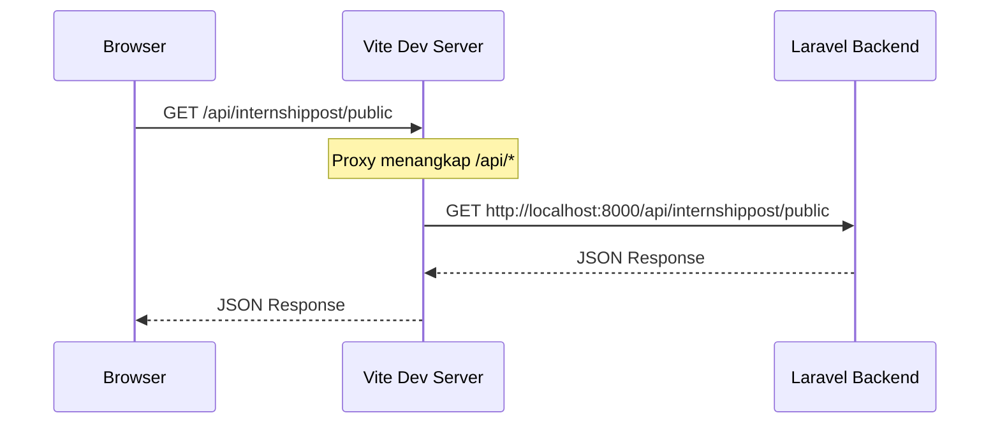

# Environment Variables

## Konfigurasi

Aplikasi IIF Frontend menggunakan **Vite environment variables** yang di-prefix dengan `VITE_`.

### File `.env.example`

```ini
VITE_API_BASE_URL=alamat-backend
```

### Pengaturan Development

```ini
VITE_API_BASE_URL=http://localhost:8000
```

### Pengaturan Docker

```ini
VITE_API_BASE_URL=http://host.docker.internal:8000
```

## Cara Kerja

### Vite Proxy

Environment variable digunakan di `vite.config.js` untuk proxy API:

```js{5-8}
export default defineConfig(({ mode }) => {
  const env = loadEnv(mode, process.cwd())
  return {
    server: {
      proxy: {
        '/api': {
          target: env.VITE_API_BASE_URL,
          changeOrigin: true,
          secure: false,
        }
      }
    }
  }
})
```

### Flow Request



::: info Catatan
Di **production**, Vite proxy tidak aktif. Pastikan web server (Nginx/Apache) dikonfigurasi untuk mengarahkan `/api/*` ke backend Laravel.
:::

## Variable yang Tersedia

| Variable | Wajib | Deskripsi |
|----------|-------|-----------|
| `VITE_API_BASE_URL` | ✅ Ya | Base URL backend Laravel API |

::: tip Menambah Variable Baru
Semua variable yang ingin diakses di client-side **harus** menggunakan prefix `VITE_`. Variable tanpa prefix hanya tersedia di server-side (vite.config.js).

```js
// ✅ Bisa diakses di komponen Vue
console.log(import.meta.env.VITE_API_BASE_URL)

// ❌ Tidak bisa diakses di client
console.log(import.meta.env.SECRET_KEY)
```
:::
