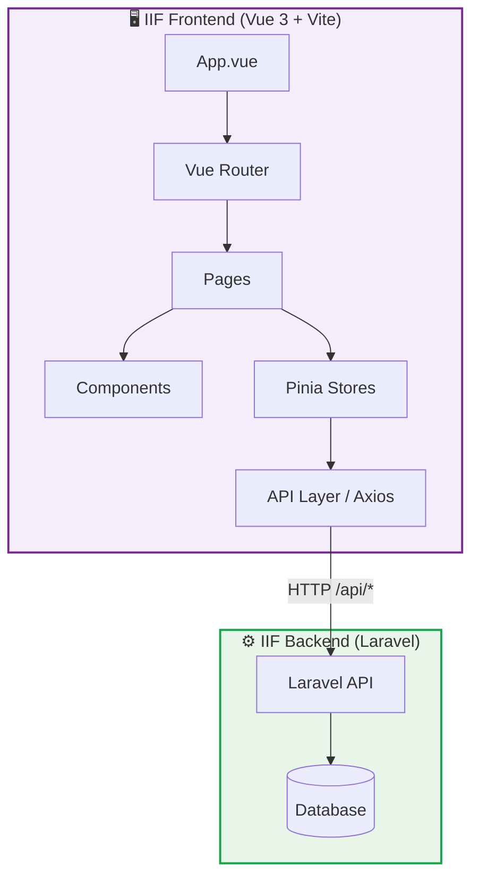

# Ringkasan Proyek

## Apa itu IIF (Iftern)?

**IIF (Iftern)** adalah platform informasi magang (internship) yang dibangun untuk membantu mahasiswa menemukan peluang magang dan studi independen. Aplikasi ini menyediakan:

- **Halaman Publik** — Landing page, pencarian lowongan, filter lokasi, dan detail magang
- **Panel Admin** — Dashboard, manajemen postingan, mitra, user, testimoni, approval, dan aktivitas sistem

## Tujuan Dokumentasi

Dokumentasi ini dibuat khusus untuk tim **frontend developer** yang bekerja pada project IIF. Cakupan dokumentasi meliputi:

| Topik | Deskripsi |
|-------|-----------|
| Tech Stack | Framework, library, dan tools yang digunakan |
| Arsitektur | Struktur aplikasi, routing, state management, API layer |
| Komponen | Daftar dan penjelasan setiap komponen Vue |
| Styling | Design system, tokens, tipografi, animasi |
| Deployment | Docker setup, CI/CD pipeline, build process |

## Arsitektur Tingkat Tinggi

## Quick Links

- 📦 [Tech Stack](/introduction/tech-stack) — Framework & library yang digunakan
- 📁 [Struktur Folder](/introduction/folder-structure) — Penjelasan setiap folder
- 🚀 [Instalasi](/getting-started/installation) — Cara setup development
- 🏗️ [Arsitektur](/architecture/app-architecture) — Penjelasan arsitektur aplikasi
