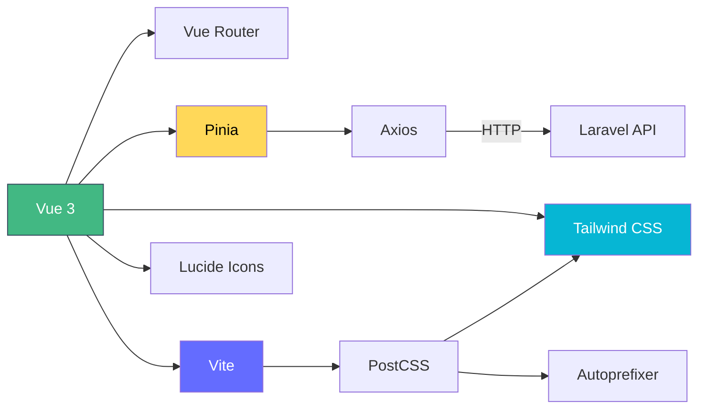

# Tech Stack

## Core Framework

| Teknologi | Versi | Fungsi |
|-----------|-------|--------|
| **Vue 3** | `^3.5.32` | Framework UI utama dengan Composition API (`<script setup>`) |
| **Vite** | `^8.0.4` | Build tool & dev server dengan Hot Module Replacement (HMR) |
| **Vue Router** | `^5.0.4` | Client-side routing dengan navigation guard |
| **Pinia** | `^3.0.4` | State management (pengganti Vuex) |

## HTTP & Data

| Teknologi | Versi | Fungsi |
|-----------|-------|--------|
| **Axios** | `^1.15.1` | HTTP client untuk komunikasi ke backend API |

## UI & Styling

| Teknologi | Versi | Fungsi |
|-----------|-------|--------|
| **Tailwind CSS** | `^3.4.19` | Utility-first CSS framework |
| **PostCSS** | `^8.5.9` | CSS preprocessor (digunakan oleh Tailwind) |
| **Autoprefixer** | `^10.4.27` | Vendor prefix otomatis |
| **Lucide Vue Next** | `^1.0.0` | Icon library berbasis SVG |

## Fonts (Google Fonts)

```css
/* Diimpor di style.css */
@import url('https://fonts.googleapis.com/css2?family=Orbitron&family=Poppins&family=Plus+Jakarta+Sans&family=Inter&display=swap');
```

| Font | Penggunaan |
|------|------------|
| **Plus Jakarta Sans** | Body text utama |
| **Poppins** | Heading (`h1` – `h6`) |
| **Inter** | Alternatif body text |
| **Orbitron** | Elemen dekoratif / branding |

## DevOps & Deployment

| Teknologi | Fungsi |
|-----------|--------|
| **Docker** | Containerisasi aplikasi |
| **Docker Compose** | Orchestrasi multi-container |
| **GitLab CI/CD** | Pipeline otomatis: build → prepare → deploy |
| **SonarQube** | Static code analysis (via `sonar-project.properties`) |

## Diagram Dependency



## Mengapa Tech Stack Ini?

::: tip Vue 3 Composition API
Menggunakan `<script setup>` untuk kode yang lebih ringkas, tree-shakeable, dan mudah di-type. Semua komponen di project ini menggunakan Composition API.
:::

::: tip Pinia vs Vuex
Pinia dipilih karena API yang lebih sederhana, dukungan TypeScript out-of-the-box, dan kompatibilitas penuh dengan Vue 3. Tidak memerlukan mutations — cukup `state`, `getters`, dan `actions`.
:::

::: tip Vite vs Webpack
Vite memberikan instant HMR dan cold start yang jauh lebih cepat dibanding Webpack. Build menggunakan Rollup untuk production bundle yang optimal.
:::
